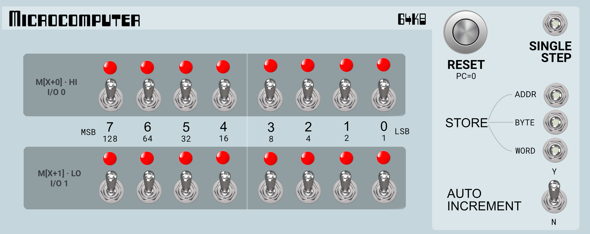
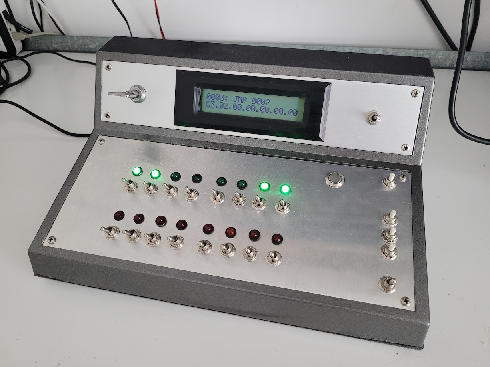
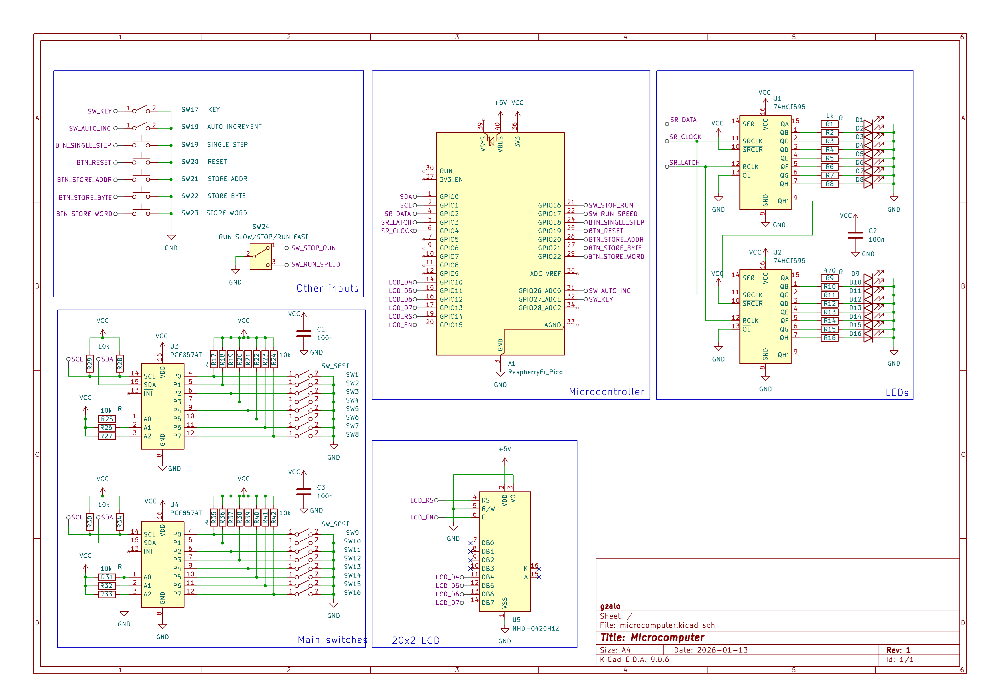

# Microcomputer project

An Altair/Imsai style microcomputer project based on a Raspberry Pi Pico (RP2040). Instruction set is 8080, but in the future it may be switchable between 8080, 6502, Z80, RISC-V, ARM, etc. 

Address space will be 16 bit so maximum RAM/ROM is 64 KiB. 

Extra I/O devices like keyboard and console may be added later.

[Try the web version here!](https://gzalo.github.io/microcomputer/)

## Hardware

- Inputs: 
  - 16 addr/data switches (read using two pcf8574 with pullups) 
  - 8 extra buttons/switches that are read directly:
    - 2 inputs connected to 3 position switches: stop/run slow/run fast
    - 1 input connected to a momentary push button: single step
    - 1 input connected to a momentary push button: reset (PC=0)
    - 1 input connected to a momentary push button: store to address latch
    - 1 input connected to a momentary push button: store byte
    - 1 input connected to a momentary push button: store word
    - 1 input connected to a switch: auto increment Y/N
- Outputs:
  - 16 LEDs for low and high parts (driven by 2 cascaded 74hc595) 
  - 6 for alphanumeric 16x2 LCD (low 4 bits + rs + enable)

## AI

The firmware for this project was created with Claude Code (Opus 4.5 model). [I've recorded most of the prompts in here](ai_prompts.md).

