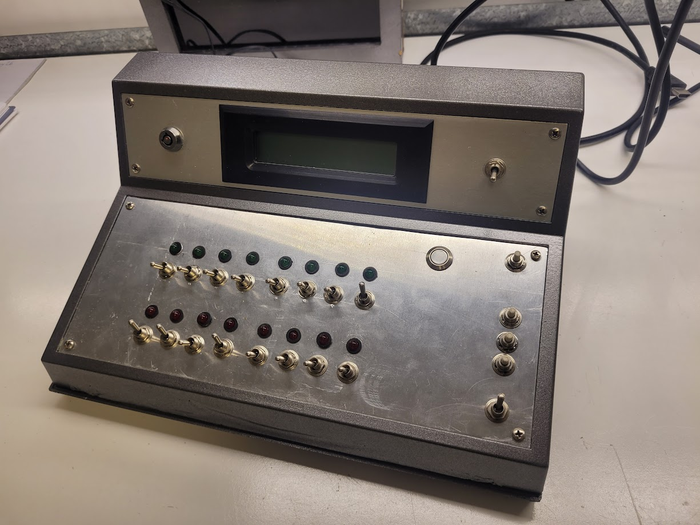

# Microcomputer project

An Altair/Imsai style microcomputer project based on a raspberry pi pico. Instruction set will be switchable between 8080, 6502, Z80, RISC-V, ARM, etc. Address space will be 16 bit so max 64kB RAM/ROM.  
Other I/O devices like keyboard and console may be added later.

## Tech details

- Inputs: 16 addr/data switches (read using two pcf8574 with pullups) + 7 extra buttons/switches read directly
- Outputs: 16 LED (driven by 2x 74hc595) + 6 for alphanumeric 16x2 LCD

- LCD:
`0123: Mov X, R0`
`00.01.10.01.12.15`
(underscore one or two bytes depending on the case)
